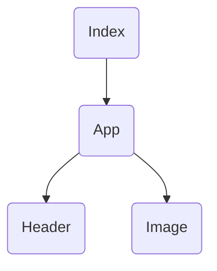

# Project tree

The project uses `React.JS`. So it's built based on components
you can see the tree below

---

# Index of the tree
- [index](https://github.com/xtvlw/Doggo-img/blob/main/docs/components/index.md)
	- [App](https://github.com/xtvlw/Doggo-img/blob/main/docs/components/App.md)
		- [Header](https://github.com/xtvlw/Doggo-img/blob/main/docs/components/Header.md)
		- [Image](https://github.com/xtvlw/Doggo-img/blob/main/docs/components/Image.md)
